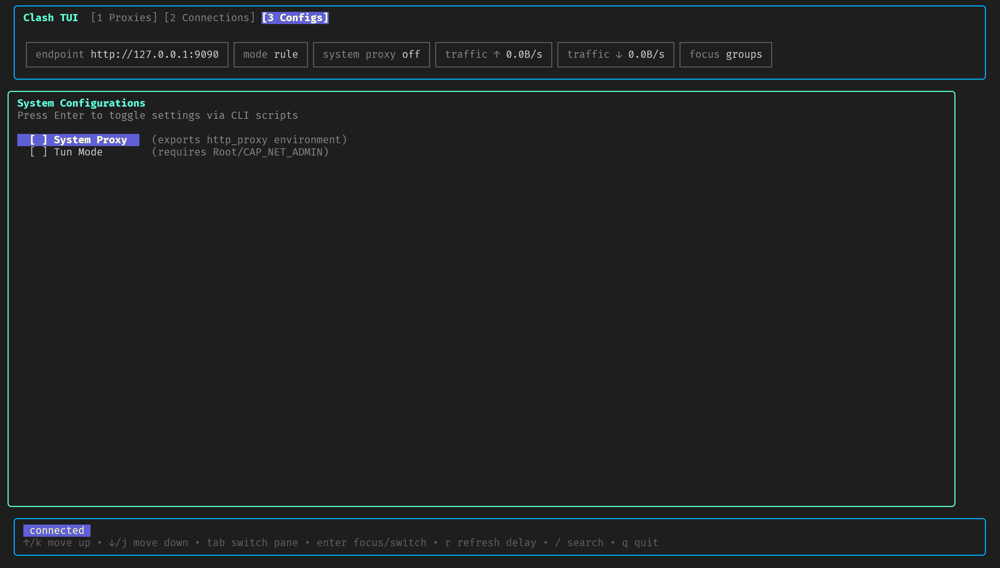
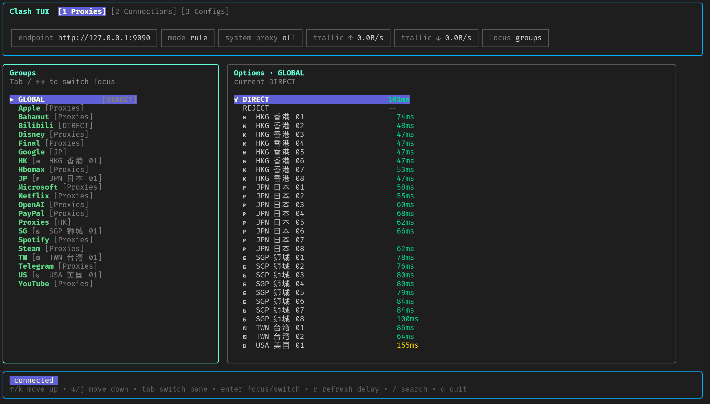

# LabProxy


<p align="center">
  <a href="./README.md">简体中文</a> | <strong>English</strong>
</p>

<p align="center">
  <a href="https://github.com/Azhi-ss/labproxy/blob/main/LICENSE">
    
  </a>
  
</p>

<p align="center"><b>A user-space proxy manager built for labs and shared servers</b></p>

---

## Why LabProxy?

| Traditional approach | LabProxy |
|---------|---------|
| Requires sudo privileges | ✅ Pure user space, no root required |
| Depends on GUI or systemd | ✅ CLI-only, PID-file based management |
| Fails to start when ports conflict | ✅ Automatically detects and assigns available ports |
| Conflicts in multi-user environments | ✅ Fully isolated per-user directory |


**LabProxy** is based on [clash-for-linux-install](https://github.com/nelvko/clash-for-linux-install) and optimized for lab/shared-server scenarios:

- **Unprivileged install** — installs into `~/.labproxy/`, works for regular users
- **Smart port handling** — 7890/9090 already taken? It automatically finds available ports
- **TUI interface** — terminal-native management with live traffic, proxy, and connection views
- **Web dashboard** — browser-based management with secret protection
- **Automatic subscription conversion** — built-in subconverter for multiple subscription formats

---

## Quick Start

```bash
# 1. Clone and install
git clone https://github.com/Azhi-ss/labproxy.git && cd labproxy
bash install.sh

# 2. Configure subscription (required)
labproxy subscribe https://your-subscription-url

# 3. Start
labproxy on

# 4. Verify
curl -I https://www.google.com
```

<details>
<summary><b>📋 Full Installation Guide</b></summary>

**Requirements**
- Shell: `bash` / `zsh` / `fish`
- Privileges: regular user only, no sudo required
- Dependency: a valid Clash subscription URL

**Installation flow**
```bash
git clone https://github.com/Azhi-ss/labproxy.git
cd labproxy
bash install.sh        # installs to ~/.labproxy/ by default
```

The installer automatically:
- downloads the correct mihomo binary for your architecture
- configures shell environment variables
- sets command aliases
- detects and assigns available ports

</details>

---

## Core Commands

```
labproxy on              # start proxy
labproxy off             # stop proxy
labproxy status          # show status
labproxy tui             # open the TUI
```

| Command | Description |
|-----|------|
| `labproxy port [set <port>\|auto\|status]` | pin a port / auto-assign |
| `labproxy lan [on\|off\|status]` | LAN access control |
| `labproxy proxy [on\|off\|status]` | system proxy toggle |
| `labproxy subscribe [URL]` | set/show subscription |
| `labproxy update [auto]` | refresh subscription config |
| `labproxy ui` | show web dashboard address |
| `labproxy mixin [-e\|-r]` | edit/show config |

---

## Agent-Native (Machine-Readable Output)

LabProxy's differentiator is being an **agent-native proxy control plane**: every query/action command supports `--json`, emitting a stable-schema JSON envelope for scripts and AI agents to parse.

### JSON Envelope Schema

All `--json` output follows one envelope:

```json
{
  "ok": true,          // whether the operation succeeded
  "data": <any>,       // payload on success, null on failure
  "error": ""          // empty on success, error message on failure
}
```

### Commands Supporting --json

| Command | data field |
|---------|------------|
| `labproxy status --json` | `{running, pid, proxy_port, ui_port, dns_port, mode, system_proxy, uptime}` |
| `labproxy proxies --json` | raw mihomo `/proxies` response |
| `labproxy connections --json` | raw mihomo `/connections` response |
| `labproxy connections close <id\|all> --json` | `{closed: "<id\|all>"}` |
| `labproxy delay <name> --json` | `{name, delay}` (ms; ok=false on failure) |
| `labproxy test [group] --json` | `{group, results: {name: delay}}` (failed nodes delay=-1) |
| `labproxy logs -f --json` | one envelope per line `{level, payload}` |
| `labproxy dns <name> [--type A] --json` | mihomo `/dns/query` response `{Status, Question, Answer}` |
| `labproxy profile <list\|create\|delete\|use> --json` | `[]` profile names or `{name}` |
| `labproxy doctor --json` | `{checks: [{name, ok, detail}]}` (per-check ok) |

### Example: agent reads runtime status

```bash
$ labproxy status --json
{"ok":true,"data":{"running":true,"pid":12345,"proxy_port":7890,"ui_port":9090,"dns_port":15353,"mode":"rule","system_proxy":true,"uptime":"01:23:45"},"error":""}
```

### Example: batch delay test and pick the fastest

```bash
$ labproxy test GLOBAL --json
{"ok":true,"data":{"group":"GLOBAL","results":{"Node-A":50,"Node-B":120,"Node-C":-1}},"error":""}
```

> `--json` output contains no ANSI color codes; without `--json`, human-readable colored text is emitted.

---

## Rules Management

```bash
# Open the rules manager modal by pressing R inside the TUI
labproxy tui  # press R

# CLI subcommands
labproxy rules list
labproxy rules add --type=DOMAIN-SUFFIX --payload=example.com --proxy=PROXY
labproxy rules disable 0
labproxy rules enable 0
labproxy rules move 0 2
labproxy rules delete 0
labproxy rules import --source=preset:direct
labproxy rules import --source=https://example.com/rules.yaml
labproxy rules export --out=./my-rules.yaml
labproxy rules reset -y
labproxy rules providers list
labproxy rules providers add --name=google --type=http --behavior=domain \
    --url=https://example.com/g.yaml --path=./providers/google.yaml --interval=86400
labproxy rules providers refresh google
```

Supported rule types: `DOMAIN`, `DOMAIN-SUFFIX`, `DOMAIN-KEYWORD`, `DOMAIN-REGEX`, `IP-CIDR`, `IP-CIDR6`, `SRC-IP-CIDR`, `SRC-PORT`, `GEOIP`, `GEOSITE`, `RULE-SET`, `MATCH`, `MATCH-SRC`.

---

## TUI Interface

```bash
labproxy tui
```


**Hotkeys**
| Key | Action |
|-----|------|
| `↑/↓` or `j/k` | navigate |
| `Tab` / `←/→` | switch panels (Groups / Options / Settings) |
| `Enter` | apply |
| `s` | focus Settings |
| `m` | switch proxy mode |
| `p` | toggle system proxy |
| `r` | refresh delay |
| `/` | search |
| `q` | quit |

<details>
<summary><b>📸 Real UI Screenshots</b></summary>

| CLI | TUI |
|:---:|:---:|
|  |  |

</details>

> **Maintainer note**: after changing TUI source code, run `VERSION=dev bash scripts/build-tui.sh` to regenerate prebuilt archives.

---

## Project Layout

```
labproxy/                          ~/.labproxy/
├── cmd/labproxy-tui/              ├── bin/
├── internal/                      │   ├── mihomo              # proxy core
│   ├── config/                    │   ├── labproxy-tui        # TUI
│   ├── proxy/                     │   ├── subconverter        # subscription conversion
│   └── tui/                       │   └── yq                  # YAML utility
├── scripts/                       ├── config/
│   ├── proxyctl.sh                │   ├── mixin.yaml
│   ├── common.sh                  │   └── ports.conf
│   └── build-tui.sh               ├── logs/
├── resources/zip/                 │   └── labproxy.log
├── install.sh                     ├── scripts/
├── go.mod                         └── ui/
└── README.md
```

---

## FAQ

**Q: Will the proxy stop after my SSH session disconnects?**  
A: No. It runs in the background via `nohup`, independent of your SSH session.

**Q: How do I pin the proxy port?**  
A: Use `labproxy port set 7890`. If that port is occupied, LabProxy will prompt/handle reassignment.

**Q: The web dashboard does not open. What should I check?**  
A: Make sure the management port is allowed by your firewall. The default is 9090, but it may change if there is a conflict.

**Q: How can other devices on my LAN use it?**  
A: Run `labproxy lan on`, then configure those devices to use `http://<your-host-ip>:<port>` as the proxy.

---

## Related Projects

- [mihomo](https://github.com/MetaCubeX/mihomo) — proxy core
- [subconverter](https://github.com/tindy2013/subconverter) — subscription conversion
- [zashboard](https://github.com/Zephyruso/zashboard) — Web UI
- [Bubble Tea](https://github.com/charmbracelet/bubbletea) — TUI framework

Originally derived from [clash-for-linux-install](https://github.com/nelvko/clash-for-linux-install).

## License

[MIT License](LICENSE)

---

<p align="center">
  If this tool helps you, please give it a ⭐ <a href="https://github.com/Azhi-ss/labproxy">Star</a>
</p>
