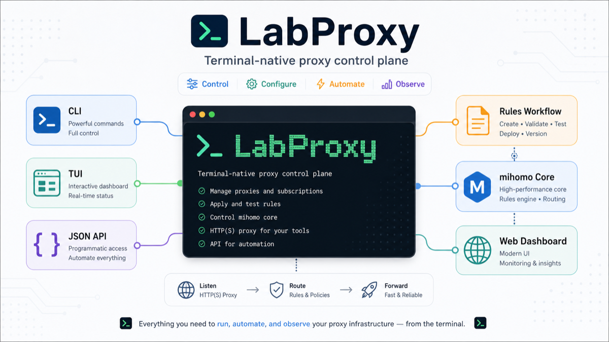

# LabProxy

<p align="center">
  <strong>English</strong> | <a href="./README.en.md">简体中文</a>
</p>

<p align="center">
  <a href="https://github.com/Azhi-ss/labproxy/blob/main/LICENSE">
    
  </a>
  
</p>

<p align="center"><b>Terminal-native proxy control plane for humans, scripts, and AI agents.</b></p>

<p align="center">
  
</p>

LabProxy turns a mihomo-based proxy setup into a terminal-first control plane. It installs into `~/.labproxy/`, avoids root-only service assumptions, exposes scriptable JSON output, and keeps day-to-day operations available from CLI, TUI, and web dashboard.

It is based on [clash-for-linux-install](https://github.com/nelvko/clash-for-linux-install), with the extra goal of being easy for automation and coding agents to inspect, control, and verify.

## Why LabProxy?

| Traditional proxy setup | LabProxy |
| --- | --- |
| Needs sudo or system service access | User-space install under `~/.labproxy/` |
| GUI-first, hard to automate | CLI/TUI/web plus stable `--json` output |
| Port conflicts break startup | Detects occupied ports and assigns available ones |
| Multi-user machines collide on config | Isolated per-user runtime directory |
| Rule changes are manual and risky | Inspect, fetch, validate, plan, apply, verify, rollback |

## Quick Start

```bash
git clone https://github.com/Azhi-ss/labproxy.git
cd labproxy
bash install.sh

labproxy subscribe https://your-subscription-url
labproxy on
labproxy status
curl -I https://www.google.com
```

Requirements:

- `bash`, `zsh`, or `fish`
- A valid Clash-compatible subscription URL
- No sudo requirement for the default install path

## Core Commands

```bash
labproxy on              # start proxy
labproxy off             # stop proxy
labproxy status          # show runtime status
labproxy tui             # open the terminal UI
labproxy ui              # print web dashboard address
```

| Command | Purpose |
| --- | --- |
| `labproxy port [set <port>|auto|status]` | Pin or auto-assign proxy ports |
| `labproxy lan [on|off|status]` | Control LAN access |
| `labproxy proxy [on|off|status]` | Toggle system proxy settings |
| `labproxy subscribe [URL]` | Set or show subscription URL |
| `labproxy update [auto]` | Refresh subscription config |
| `labproxy mixin [-e|-r]` | Edit or show mixin config |
| `labproxy doctor` | Run local health checks |

## Agent-Native JSON

Every query/action command that supports automation emits the same envelope with `--json`:

```json
{
  "ok": true,
  "data": {},
  "error": ""
}
```

Examples:

```bash
labproxy status --json
labproxy proxies --json
labproxy connections --json
labproxy delay "Node-A" --json
labproxy test GLOBAL --json
labproxy dns example.com --type A --json
labproxy doctor --json
```

Common payloads:

| Command | `data` |
| --- | --- |
| `status --json` | `{running, pid, proxy_port, ui_port, dns_port, mode, system_proxy, uptime}` |
| `proxies --json` | Raw mihomo `/proxies` response |
| `connections --json` | Raw mihomo `/connections` response |
| `connections close <id|all> --json` | `{closed}` |
| `delay <name> --json` | `{name, delay}` |
| `test [group] --json` | `{group, results}` |
| `logs -f --json` | One JSON envelope per log line |
| `profile <list|create|delete|use> --json` | Profile names or selected `{name}` |

`--json` output is ANSI-free. Human-readable commands keep colored terminal output.

## Rules Workflow

The workflow path is designed to make rule provider changes reviewable before they touch your active mixin:

```bash
labproxy rules workflow candidates
labproxy rules workflow inspect
labproxy rules workflow fetch --candidates=github,openai
labproxy rules workflow validate --endpoint=http://127.0.0.1:9090 --candidates=github,openai
labproxy rules workflow plan --candidates=github,openai
labproxy rules workflow apply --endpoint=http://127.0.0.1:9090 --candidates=github,openai
labproxy rules workflow verify --endpoint=http://127.0.0.1:9090 --reload-config=/Users/azhi/.labproxy/runtime.yaml
labproxy rules workflow rollback --backup=/path/to/mixin.yaml.preapply-20260702-120000
```

Default provider-to-group mapping:

```text
github -> Proxies
openai -> OpenAI
anthropic -> OpenAI
youtube -> YouTube
netflix -> Netflix
disney -> Disney
telegram -> Telegram
```

Run `validate` and `plan` before `apply`. `apply` validates again, refuses unknown strategy groups, preserves local override rules above generated `RULE-SET` entries, and prints the backup path used for rollback.

When calling the installed `labproxy` wrapper, the active mixin path is injected automatically. When running the raw `labproxy-tui` binary directly, pass `--mixin-config /Users/azhi/.labproxy/mixin.yaml` after `rules`.

## Direct Rules Commands

```bash
labproxy rules list
labproxy rules add --type=DOMAIN-SUFFIX --payload=example.com --proxy=PROXY
labproxy rules disable 0
labproxy rules enable 0
labproxy rules move 0 2
labproxy rules delete 0
labproxy rules import --source=preset:direct
labproxy rules import --source=https://example.com/rules.yaml
labproxy rules export --out=./my-rules.yaml
labproxy rules reset -y
labproxy rules providers list
labproxy rules providers add --name=google --type=http --behavior=domain \
  --url=https://example.com/g.yaml --path=./providers/google.yaml --interval=86400
labproxy rules providers refresh google
```

Supported rule types: `DOMAIN`, `DOMAIN-SUFFIX`, `DOMAIN-KEYWORD`, `DOMAIN-REGEX`, `IP-CIDR`, `IP-CIDR6`, `IP-ASN`, `SRC-IP-CIDR`, `SRC-PORT`, `GEOIP`, `GEOSITE`, `RULE-SET`, `MATCH`, `MATCH-SRC`.

## TUI

```bash
labproxy tui
```

The TUI has five persistent views:

| Key | View | Main actions |
| --- | --- | --- |
| `1` | Proxies | Search, delay test, switch node |
| `2` | Connections | Close one or all connections |
| `3` | Logs | Filter and change log level |
| `4` | Rules | Add, edit, delete rules |
| `5` | Config | Toggle runtime settings |

Global keys: `Tab` cycle focus, `r` refresh, `?` help, `q` quit.

Maintainer note: after changing TUI source code, run:

```bash
VERSION=dev bash scripts/build-tui.sh
```

## Project Layout

```text
labproxy/                          ~/.labproxy/
├── cmd/labproxy-tui/              ├── bin/
├── internal/                      │   ├── mihomo
│   ├── config/                    │   ├── labproxy-tui
│   ├── proxy/                     │   ├── subconverter
│   └── tui/                       │   └── yq
├── scripts/                       ├── config/
│   ├── proxyctl.sh                │   ├── mixin.yaml
│   ├── common.sh                  │   └── ports.conf
│   └── build-tui.sh               ├── logs/
├── resources/zip/                 │   └── labproxy.log
├── install.sh                     ├── scripts/
├── go.mod                         └── ui/
└── README.md
```

## FAQ

**Will the proxy stop after my SSH session disconnects?**
No. LabProxy runs the proxy core in the background, independent of the SSH session.

**How do I pin the proxy port?**
Use `labproxy port set 7890`. If the port is occupied, LabProxy handles reassignment.

**The web dashboard does not open. What should I check?**
Check the management port. The default is 9090, but it may change if there is a conflict.

**How can other devices on my LAN use it?**
Run `labproxy lan on`, then configure those devices to use `http://<your-host-ip>:<port>`.

## Related Projects

- [mihomo](https://github.com/MetaCubeX/mihomo) - proxy core
- [subconverter](https://github.com/tindy2013/subconverter) - subscription conversion
- [zashboard](https://github.com/Zephyruso/zashboard) - web dashboard
- [Bubble Tea](https://github.com/charmbracelet/bubbletea) - TUI framework

## License

[MIT License](LICENSE)

<p align="center">
  If this tool helps you, please give it a <a href="https://github.com/Azhi-ss/labproxy">star on GitHub</a>.
</p>
